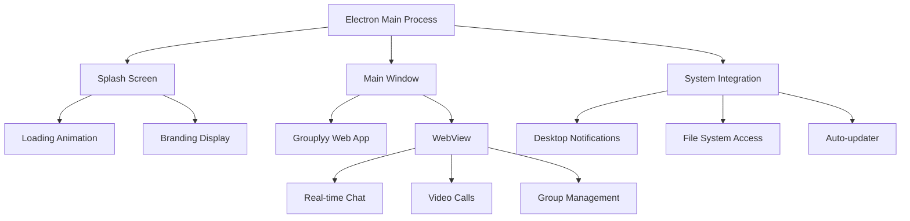

# 💻 Grouplyy Desktop

> **Cross-platform desktop wrapper** for Grouplyy - Real-time messaging, HD video calls, and team collaboration powered by Electron.

[](https://www.electronjs.org/)  
[](https://developer.mozilla.org/en-US/docs/Web/JavaScript)  
[](https://nodejs.org/)  
[](https://opensource.org/licenses/MIT)

---

## ✨ Features

### 🖥️ **Desktop Experience**
- **Native desktop app** for Windows, macOS, and Linux
- **Custom splash screen** with animated loading
- **System tray integration** and native menus
- **Auto-updater support** via Electron Forge

### 🎨 **Beautiful UI**
- **Animated splash screen** with rotating quotes
- **Custom branding** with Grouplyy logo
- **Responsive design** that adapts to different screen sizes
- **Smooth transitions** and loading animations

### 🔗 **Web Integration**
- **Seamless web app loading** from `https://www.grouplyy.xyz/electron`
- **Secure context bridge** for future desktop-specific features
- **Cross-platform compatibility** with native performance

---

## 🛠️ Tech Stack

| Category | Technology | Purpose |
|----------|------------|---------|
| **Framework** | Electron 38.1.0 | Desktop wrapper |
| **Language** | JavaScript ES6 | Core logic |
| **Build Tool** | Electron Forge 7.9.0 | Packaging & distribution |
| **Styling** | CSS3 | Splash screen styling |
| **Web App** | Grouplyy Web | Main application |

---

## 🏗️ Architecture



---

## 🚀 Quick Start

### Prerequisites
- **Node.js** 18+ 
- **npm** package manager
- **Git** for version control

### 1️⃣ Clone & Install
```bash
git clone https://github.com/CryptoGuyDeve/grouplyy-desktop.git
cd grouplyy-desktop
npm install
```

### 2️⃣ Development
```bash
# Start development server
npm run start

# Package the app
npm run package

# Create distributables
npm run make
```

### 3️⃣ Distribution
The built app will be available in the `out` folder:
- **Windows**: `out/make/squirrel.windows/x64/grouply-desktop-1.0.0 Setup.exe`
- **Linux**: `.deb` and `.rpm` packages
- **macOS**: `.dmg` and `.zip` files

---

## 📁 Project Structure

```
grouplyy-desktop/
├── assets/
│   ├── icon.png          # App icon
│   ├── logo.png          # Splash screen logo
│   └── iconn.png         # Alternative icon
├── out/                  # Built applications
├── main.js               # Electron main process
├── preload.js            # Context bridge setup
├── splash.html           # Splash screen HTML
├── splash.css            # Splash screen styling
├── forge.config.js       # Electron Forge configuration
└── package.json          # Project dependencies
```

---

## ⚙️ Configuration

### Main Process (`main.js`)
- **Window Management**: Creates main window and splash screen
- **Icon Configuration**: Sets custom app icon for all platforms
- **Web App Loading**: Loads Grouplyy web application
- **Event Handling**: Manages window lifecycle events

### Splash Screen (`splash.html` + `splash.css`)
- **Animated Loading**: CSS animations and transitions
- **Rotating Quotes**: JavaScript-powered quote rotation
- **Branding**: Grouplyy logo and tagline display
- **Social Links**: Quick access to social media

### Build Configuration (`forge.config.js`)
- **Packaging**: ASAR packaging for security
- **Icon Setup**: Custom icon for all platforms
- **Makers**: Windows (Squirrel), Linux (DEB/RPM), macOS (ZIP)
- **Security**: Electron Fuses for enhanced security

---

## 🎯 Key Features

### 🚀 **Splash Screen**
- **4-second animated loading** with smooth transitions
- **Rotating inspirational quotes** that change every 4 seconds
- **Custom branding** with Grouplyy logo
- **Social media links** for community engagement

### 🖥️ **Desktop Integration**
- **Native window controls** and system integration
- **Custom app icon** in taskbar and system menus
- **Responsive window sizing** (1200x800 default)
- **Cross-platform compatibility**

### 🔒 **Security Features**
- **Context Bridge**: Secure communication between main and renderer processes
- **ASAR Packaging**: Code protection and faster loading
- **Electron Fuses**: Enhanced security configurations
- **Auto-updater Ready**: Built-in update mechanism

---

## 🔄 Development Workflow

### Local Development
```bash
# Start the app in development mode
npm run start
```

### Building for Distribution
```bash
# Package the app (creates executable)
npm run package

# Create installers for all platforms
npm run make
```

### Testing
1. **Development Mode**: Use `npm run start` for testing
2. **Packaged App**: Test the packaged version in `out/`
3. **Installers**: Test the final installers before distribution

---

## 📦 Distribution

### Windows
- **Squirrel Installer**: `grouply-desktop-1.0.0 Setup.exe`
- **Auto-updater**: Built-in update mechanism
- **System Integration**: Start menu, desktop shortcuts

### Linux
- **DEB Package**: For Debian/Ubuntu systems
- **RPM Package**: For Red Hat/Fedora systems
- **AppImage**: Portable Linux application

### macOS
- **DMG Installer**: Drag-and-drop installation
- **ZIP Archive**: Portable macOS application
- **Code Signing**: Ready for App Store distribution

---

## 🤝 Contributing

We welcome contributions! Here's how to get started:

### 1. Fork & Clone
```bash
git clone https://github.com/CryptoGuyDeve/grouplyy-desktop.git
cd grouplyy-desktop
```

### 2. Create Feature Branch
```bash
git checkout -b feature/amazing-feature
```

### 3. Make Changes
- Follow existing code style
- Test on multiple platforms
- Update documentation as needed

### 4. Test Locally
```bash
npm run start
npm run make
```

### 5. Submit Pull Request
- Describe your changes clearly
- Test on Windows, macOS, and Linux
- Ensure all builds work correctly

---

## 📋 Development Guidelines

### Code Style
- Use modern JavaScript (ES6+)
- Follow Electron best practices
- Use meaningful variable names
- Add comments for complex logic

### Testing Checklist
- [ ] App starts without errors
- [ ] Splash screen displays correctly
- [ ] Web app loads successfully
- [ ] Icons appear in system menus
- [ ] Installers work on target platforms

---

## 🐛 Troubleshooting

### Common Issues

**App won't start:**
- Ensure Node.js 18+ is installed
- Run `npm install` to install dependencies
- Check for port conflicts

**Icons not showing:**
- Verify `assets/icon.png` exists
- Check file permissions
- Rebuild the app with `npm run make`

**Web app not loading:**
- Check internet connection
- Verify `https://www.grouplyy.xyz/electron` is accessible
- Check for firewall/antivirus blocking

---

## 📄 License

This project is licensed under the **MIT License** - see the [LICENSE](LICENSE) file for details.

---

## 🙏 Acknowledgments

- [Electron](https://www.electronjs.org/) - Desktop app framework
- [Electron Forge](https://www.electronforge.io/) - Build and distribution tools
- [Grouplyy](https://www.grouplyy.xyz/) - Web application platform

---

## 📞 Support

- **Issues**: [GitHub Issues](https://github.com/CryptoGuyDeve/grouplyy-desktop/issues)
- **Discussions**: [GitHub Discussions](https://github.com/CryptoGuyDeve/grouplyy-desktop/discussions)
- **Website**: [Grouplyy](https://www.grouplyy.xyz/)

---

**Made with ❤️ by [Faiz](https://github.com/CryptoGuyDeve)**